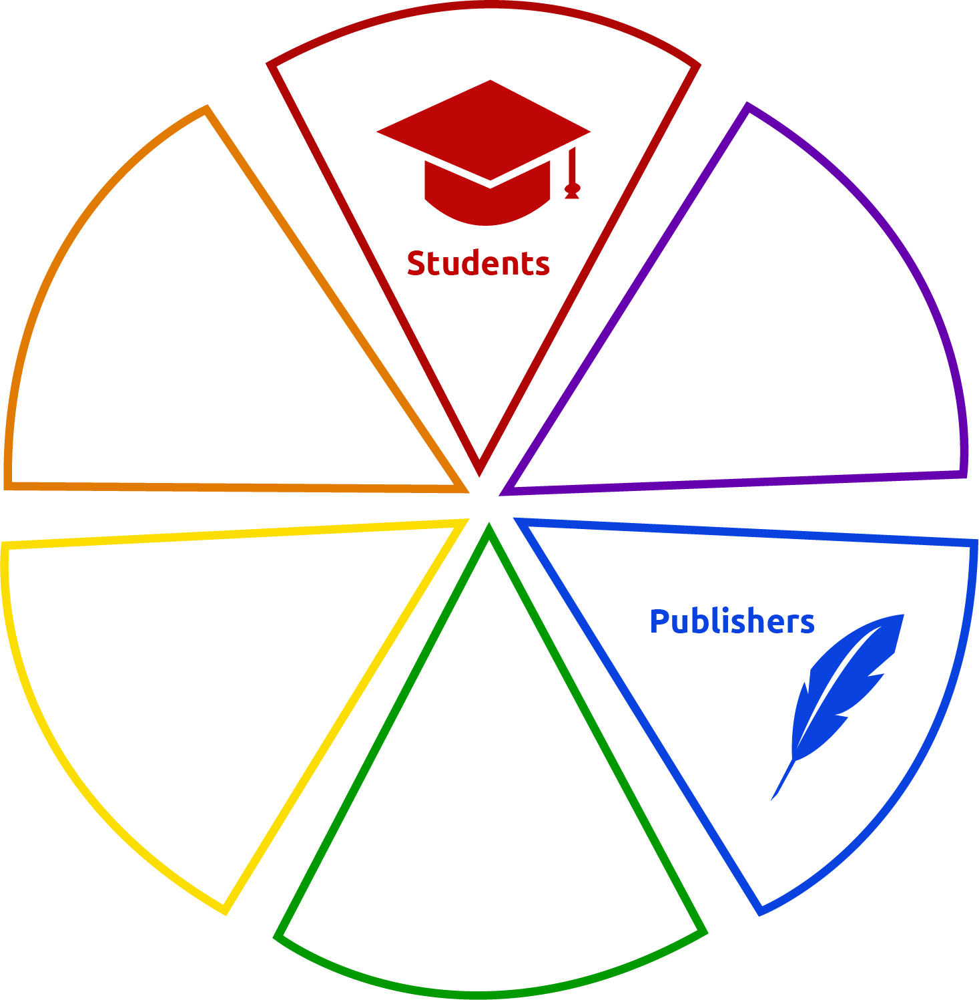

<body style="background-color: rgb(43, 43, 43); color:white">

# Eπικοινωνία Ανθρώπου-Μηχανής

## Συγγραφείς

* ### Ιωάννης Μαλιάρας - 1115201500084
* ### Ιωάννης Χείλαρης - 1115201500176
  
## Περιεχόμενα

* [Εύδοξος - Αξιολόγηση](#start)
  * [Top 5 Προβλήματα Χρηστικότητας](#top5)
  * [Μερικά θετικά σχόλια](#positive)
  * [Παραβιάσεις Κανόνων Nielsen](#nielsen)
  * [Πιθανές Λύσεις](#solutions)

# Εύδοξος - Αξιολόγηση

## Top 5 Προβλήματα Χρηστικότητας

* Άκομψος, θορυβώδης σχεδιασμός.
* Υπερβολική χρήση κειμένου, στη μέση ακριβώς της οθόνης. Είναι γνωστό, ότι ο χρήστης **δεν διαβάζει**, αλλά **σκανάρει**.
* Το μέγεθος της γραμματοσειράς που χρησιμοποιείται είναι πολύ μικρό, ειδικότερα στους επιμέρους συνδέσμους της αριστερής περιοχής πλοήγησης. Επίσης, οι χρωματικές επιλογές είναι ίσως κακές.
* Ο τίτλος δεν αντικατοπτρίζει **ακριβώς** τον σκοπό του ιστοχώρου. Χρησιμοποιεί πολλές και αχρείαστες λέξεις, τις οποίες ο χρήστης δεν θα έπρεπε να υποχρεούται να διαβάσει. 
    
    
    Ένας καλύτερος τίτλος θα ήταν: 
    * ### Υπηρεσία Διαχείρισης Συγγραμάτων
* Δεν μπορεί να διακριθεί εύκολα ο προορισμός ορισμένων συνδέσμων στην αριστερή μπάρα πλοήγησης. Επιπρόσθετα, πολλοί από αυτούς μπορεί να μπερδευθόυν μεταξύ τους, ως προς τη λειτουργία και τον προορισμό τους.

---

## Μερικά θετικά σχόλια

* Η εφαρμογή δήλωσης συγγραμμάτων είναι αρκετά λειτουργική και σαφής.

* Οι ερωτήσεις της περιοχής FAQ είναι στοχευμένες και ακριβείς, βοηθώντας τον χρήστη με τις απορίες του, παρά την κακή κατηγοριοποίηση και παρουσίαση της.  **Βοήθεια και τεκμηρίωση** 
* Υπάρχει μια [βελτιωμένη σελίδα](https://service.eudoxus.gr), η οποία προσφέρει μια μεγαλύτερη αμεσότητα και άνεση στη χρήση.
* Το μενού πλοήγησης βρίσκεται στην αριστερή πλευρά της αρχικής σελίδας, όπως συνιθίζεται, σε άλλους γνωστούς ή μη, ιστοχώρους  **Ομοιότητα με τον πραγματικό κόσμο | Χρήση προτύπων** 
* Το λογότυπο του ιστοχώρου βρίσκεται, όπως συνιθίζεται, στην πάνω αριστερή γωνία και πατώντας το, ο χρήστης οδηγείται πίσω στην αρχική σελίδα.  **Ομοιότητα με τον πραγματικό κόσμο | Χρήση προτύπων** 

---

## Παραβiάσεις Κανόνων Nielsen

1. Δεν υπάρχει τρόπος για το χρήστη να "ανιχνέυσει" την πορεία που ακολουθεί, κατα τη χρήση του ιστοχώρου.  **Ορατότητα της κατάστασης του συστήματος  | Έλεγχος** 
   
2. Οι σύνδεσμοι που χρησιμοποιούνται στις περιοχές με κείμενο, δεν φέρουν το χρώμα που περιγράφουν τα συνήθη πρότυπα. είναι πορτοκαλί, σε αντίθεση με μπλε.  **Ομοιότητα με τον πραγματικό κόσμο** 
3. Μη ξεκάθαρα και συγκεκριμένοι σύνδεσμοι, όσον αφορά τις επιμέρους λειτουργίες της εκάστοτε ομάδας χρηστών. **Μινιμαλιστική εικαστική σχεδίαση | Αναγνώριση παρά επανάκτηση**
4. Εκτεταμένη χρήση κειμένου, συνυφασμένη με πολύ μεγάλα κομμάτια με *άχρηστες* πληροφορίες.**Μινιμαλιστική εικαστική σχεδίαση**
5. Θολές, διαφορετικού εικαστικού στυλ εικόνες με ασυνεπείς λεζάντες στο δεξιό "μενού πλοήγησης".  **Συνέπεια | Μινιμαλιστική εικαστική σχεδίαση** 
6. Ασαφείς αναλογίες εικονιδίου και λειτουργίας στο  στο δεξιό "μενού πλοήγησης". Ο χρήστης δεν καταλαβαίνει διαισθητικά τη λειτουργία του κουμπιού που πατάει.  **Ομοιότητα με τον πραγματικό κόσμο** 
7. Η περιοχή FAQ είναι αρκετά κακογραμμένη. Είναι πολύ δύσκολο να βρεθέι μια απάντηση σε κάποια πιθανή ερώτηση, λόγω της *ακατάστατης* κατηγοριοποίησης της. Επίσης, ο χρωματισμός τείνει να είναι κουραστικός στο μάτι. **Βοήθεια και τεκμηρίωση**
8. Όταν ο χρήστης πατάει έναν σύνδεσμο στην αριστερή περιοχή πλοήγησης, αντί να κατευθύνεται απευθείας στον αναμενόμενο προορισμό, καθοδηγείται σε μια "μεσάζουσα" σελίδα που περιέχει οδηγίες. Εκέι, χρειάζεται να πατήσει *άλλον* έναν παρόμοιο σύνδεσμο για να καταλήξει στον επιθυμητό προορισμό. **Ευελιξία και αποδοτικότητα**
9. Τα ενημερωτικά βίντεο είναι τοποθετημένο σε αμήχανο σημείο, με αποτέλεσμα οι περισσότεροι χρήστες να μην το προσέχουν, ενώ ίσως να το χρειαστούν. Παρόλο που ένα από αυτά είναι συνοπτικό και αρκετά ξεκάθαρο (Εύδοξος+), θα μπορούσε να χαρακτηρισθεί ως "παλιομοδίτικο". **Αναγνώριση παρά επανάκτηση | Βοήθεια και τεκμηρίωση**
10. Οι σελίδες "Γενική Βάση Συγγραμμάτων" και "Επιλεγμένα Συγγράμματα.." είναι ακατάστατες και καθιστούν δύσκολη την εύρεση του επιθυμητού συγγράμματος. **Αποδοτικότητα | Μινιμαλιστική εικαστική σχεδίαση**
11. Το κουμπί "Σύνθετη Αναζήτηση" στη σελίδα "Γενική Βάση Συγγραμάτων" δεν είναι τοποθετημένο με τέτοιο τρόπο, ώστε ο χρήστης να το βλέπει απευθείας. (Συγκεκριμένα, εμείς δεν το είδαμε..) Η λειτουργικότητα υπάρχει, αλλά θέλει επιπλέον "δουλειά" για να χρησιμοποιηθεί, παρόλο που είναι πολύ συνιθισμένη απαίτηση ενός χρήστη. **Ευελιξία και αποδοτικότητα | Ομοιότητα με την πραγματικότητα**
12. Η λειτουργία αναζήτησης, απλή ή σύνθετη, όπως είναι φτιαγμένη τώρα, δεν προλαμβάνει πιθανά ορθογραφικά ή άλλα λάθη και δεν προσφέρει κάποια *αναγνώριση* ή *υπενθύμιση/πρόβλεψη* ως προς το αναζητούμενο σύγγραμμα.  **Πρόληψη Λαθών | Αναγνώριση παρά επανάκτηση** 
13. Κάθε επιμέρους εφαρμογή συνδεδεμένη με τον ιστοχώρο (Ανταλλαγή, Δήλωση Συγγραμμάτων, Εφαρμογές ομαδών χρηστών, κλπ) είναι *τελείως* διαφορετικές μεταξύ τους.  **Συνέπεια** 
14. Οι επιμέρους εφαρμογές συνδεδεμένες με τον ιστοχώρο, παρά την αποτελεσματικότητα τους, χαρακτηρίζονται από μια παλιομοδίτικη αισθητική.  **Μινιμαλιστική εικαστική σχεδίαση**   
15. Οι σύνδεσμοι αυτοί **δεν** τραβούν την προσοχή του χρήστη στο σωστό σημείο. 
     
     **Αναγνώριση παρά επανάκτηση | Βοήθεια και τεκμηρίωση**

---

## Πιθανές Λύσεις

1. Χρήση breadcrumbs.
   
2. Χρήση ορθού χρωματισμού, βάσει σύμβασης.
3. Διακριτές περιοχές για κάθε ομάδα χρηστών, με υπομενού/σελίδες που *αρμόζουν* στην κάθε μία.  
    Προτεινόμενες λύσεις:
    * Radial Menu με χρωματικά κωδικοποιημένες περιοχές, ανάλογα με την ομάδα χρηστών.  
         
        (a work **very** much in progress)
    * Περιοχές σε μορφή πίνακα για κάθε ομάδα χρήστη.
4. Το κείμενο αυτό περιέχει πληροφορίες που αφορούν την *καινοτομία που επιτυγχάνεται* απο τον ιστοχώρο, την ιστορία του και άλλες όχι άμεσα χρήσιμες πληροφορίες. Τέτοιου τύπου κείμενο θα ήταν φρόνιμο να τοποθετηθούν σε μία ειδική περιοχή/tab, τύπου "About us" ή κάτι παρόμοιο.
5. Χρήση μινιμαλιστικών και ευκρινών εικονιδίων, τα οποία αντικατοπτρίζουν σαφώς τη λειτουργία τους. Λεζάντες και υπότιτλοι μπορούν να αποφευχθούν, παρόλο που πολλές φορές είναι χρήσιμοι, ειδικά σε μεγαλύτερες ηλικίες χρηστών.
6. Παρόμοια με την λύση 5.
7. Κατ'αρχάς, η ιστοσελίδα θα πρέπει να είναι αρκετά σαφής, έτσι ώστε να μήν χρειάζεται περιοχή FAQ. Παρά ταύτα, η περιοχή αυτή μπορεί να επανασχεδιαστεί ώς εξής:
   * Η όλη περιοχή θα μπορούσε να οργανωθεί σε περισσότερες και πιο περιεκτικές κατηγορίες.
   * Οι επιμέρους ερωτήσεις θα έπρεπε να είναι πιο συνοπτικές, αν όχι απόλυτα βασισμένες σε **λέξεις-κλειδιά** με ειδικό χρωματισμό.
8. Μείωση του *δομικού βάθους* του ιστοχώρου, δια της αφαίρεσης των "μεσάζουσων" σελίδων και την εισαγωγή **ξεκάθαρων** συνδέσμων προς τις λειτουργίες του ιστοχώρου.
9. Τα ενημερωτικά/βοηθητικά βίντεο θα ήταν καλό να μετακινηθούν σε μία περιοχή τύπου "About Us" ή "Help", αν όχι να αφαιρεθούν εξ'ολοκλήρου. Επιπλέον, θα μπορούσαν να γίνουν πιο σύντομα και σίγουρα να αναβαθμισθούν σε ένα πιο σύγχρονο στυλ.
10. Χρήση αποδοτικών φίλτρων αναζήτησης και καλύτερη/ομορφότερη παρουσίαση των αποτελεσμάτων αναζήτησης.
11. Θα μπορούσε η "σύνθετη αναζήτηση" να ήταν η προεπιλεγμένη περίπτωση και όχι να απαιτεί επιπλέον κλικ από τον χρήστη. Στην περίπτωση, όμως, που θέλουμε κάτι τέτοιο, το κουμπί που οδηγεί στην αναζήτηση αυτή, θα έπρεπε να είναι σε πιο ευκρινές σημείο και ίσως να συνοδεύεται από ένα περιγραφικό εικονίδιο.
12. Θα μπορούσε το σύστημα, κατά την πληκτρολόγηση στην περιοχή αναζήτησης, να τυπώνει πιθανές προβλέψεις για αυτό που αναζητά ο χρήστης. Με αυτόν τον τρόπο αποκλείονται οποιαδήποτε ορθογραφικά ή άλλα λάθη.
13. Όλες οι επιμέρους εφαρμογές πρέπει να υλοποιηθούν εξ'αρχής, έτσι ώστε να δημιουργηθεί και να διατηρηθεί μια λειτουργική και αισθητική συνέπεια.
14. Ένας καινούργιος και σύγχρονος σχεδιασμός των εφαρμογών, ο οποίος θα ακολουθεί μινιμαλιστικά αισθητικά πρότυπα, όχι μόνο θα έκανε τους χρήστες να αισθάνονται πιο *άνετα* όταν τις χρησιμοποιούν, αλλά και θα συνεισέφερε στην προσβασιμότητά του ιστοχώρου. Πρέπει εδώ να σημειωθεί, ότι οι εφαρμογές αυτές είναι το *Άλφα και το Ωμέγα* του ιστοχώρου. Για το λόγο αυτό, ο καλός και λειτουργικός σχεδιασμός τους πρεπει να είναι **προτεραιότητα**.
15. Οι σύνδεσμοι αυτοί **τραβούν** την προσοχή του χρήστη στο σωστό σημείο. 
    

</body>
</html>